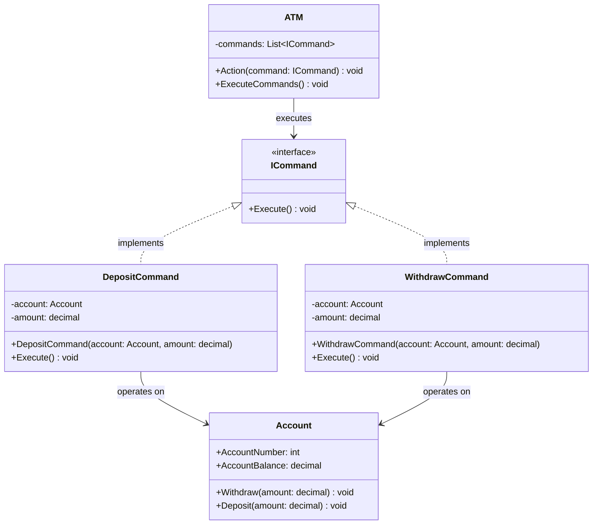

# Diagrama de Clases - Sistema ATM (Patrón Command)

## Descripción del Patrón Command

El patrón Command encapsula una solicitud como un objeto, permitiendo parametrizar clientes con diferentes solicitudes, colas o solicitudes de registro.

### Componentes:
- **ICommand**: Interfaz común para todos los comandos
- **Comandos Concretos**: DepositCommand, WithdrawCommand
- **Account**: Receptor que sabe cómo realizar las operaciones
- **ATM**: Invocador que ejecuta los comandos