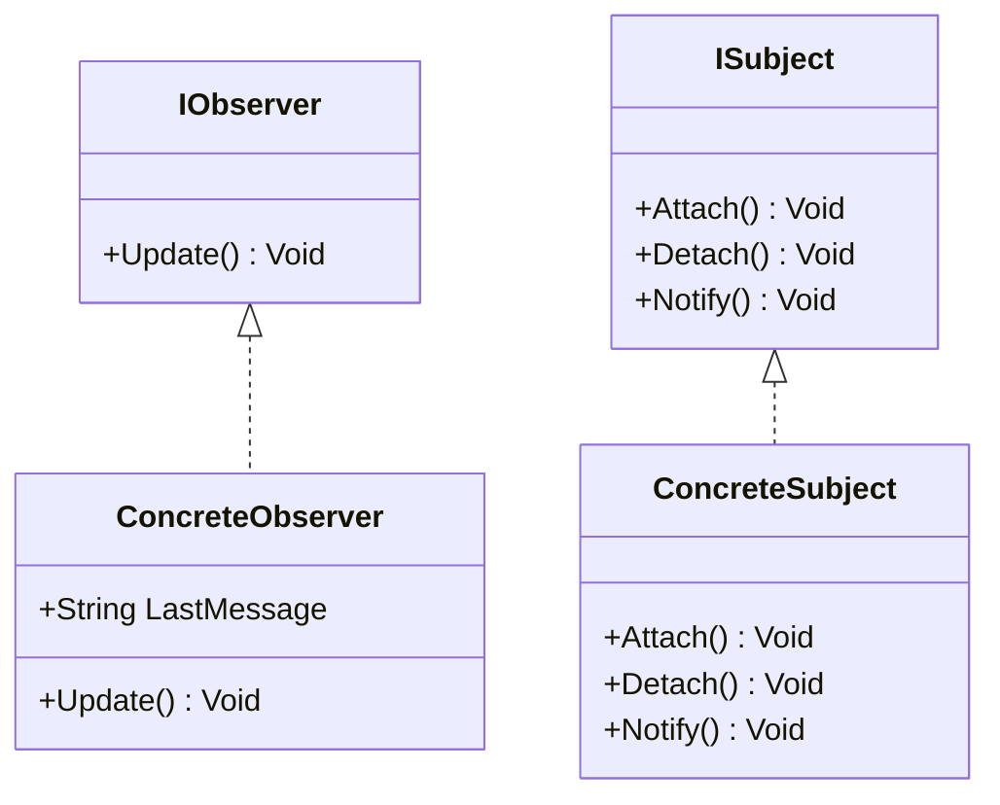

```mermaid
classDiagram

class IObserver
IObserver : +Update() Void

class ISubject
ISubject : +Attach() Void
ISubject : +Detach() Void
ISubject : +Notify() Void

class ConcreteSubject
ConcreteSubject : +Attach() Void
ConcreteSubject : +Detach() Void
ConcreteSubject : +Notify() Void

class ConcreteObserver
ConcreteObserver : +String LastMessage
ConcreteObserver : +Update() Void


ISubject <|.. ConcreteSubject
IObserver <|.. ConcreteObserver

```
