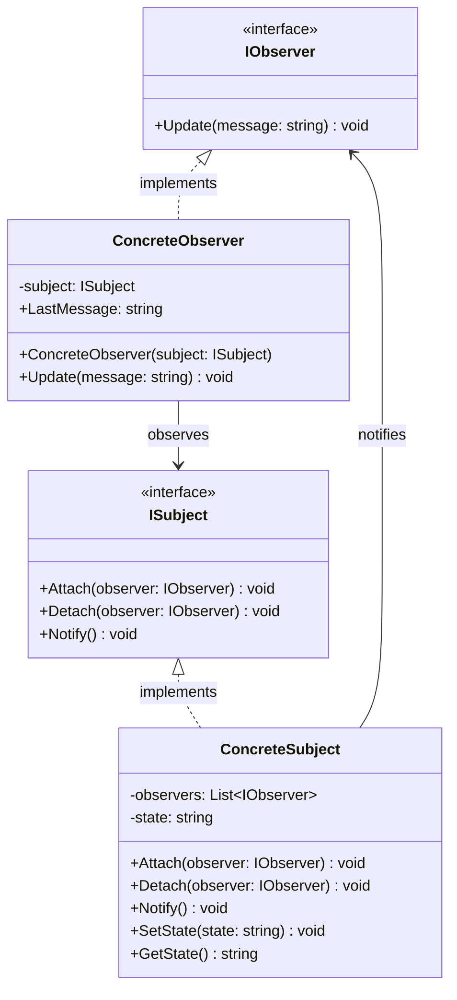

# Diagrama de Clases - Sistema de Comportamiento (Patrón Observer)

## Descripción del Patrón Observer

El patrón Observer define una dependencia uno-a-muchos entre objetos, de manera que cuando un objeto cambia su estado, todos los dependientes son notificados y actualizados automáticamente.

### Componentes:
- **IObserver**: Interfaz para objetos que deben ser notificados de cambios
- **ISubject**: Interfaz para el objeto observable
- **ConcreteSubject**: Implementación concreta del sujeto observable
- **ConcreteObserver**: Implementación concreta del observador