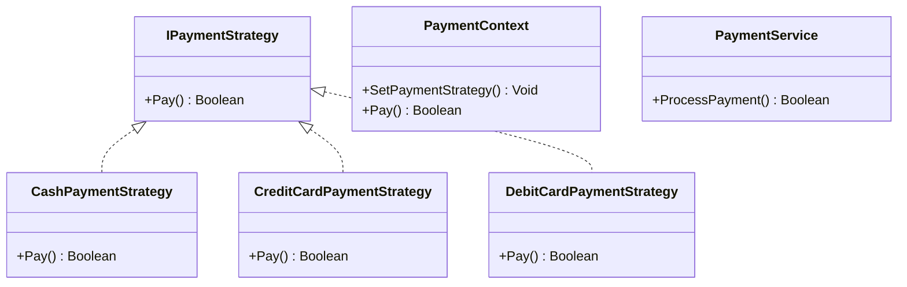

# Diseño del Sistema de Pago

Ver diagrama de clases generado automáticamente: [payment.mermaid.md](payment.mermaid.md)

```mermaid
classDiagram

class CashPaymentStrategy
CashPaymentStrategy : +Pay() Boolean

class CreditCardPaymentStrategy
CreditCardPaymentStrategy : +Pay() Boolean

class DebitCardPaymentStrategy
DebitCardPaymentStrategy : +Pay() Boolean

class IPaymentStrategy
IPaymentStrategy : +Pay() Boolean

class PaymentContext
PaymentContext : +SetPaymentStrategy() Void
PaymentContext : +Pay() Boolean

class PaymentService
PaymentService : +ProcessPayment() Boolean


IPaymentStrategy <|.. CashPaymentStrategy
IPaymentStrategy <|.. CreditCardPaymentStrategy
IPaymentStrategy <|.. DebitCardPaymentStrategy

```
