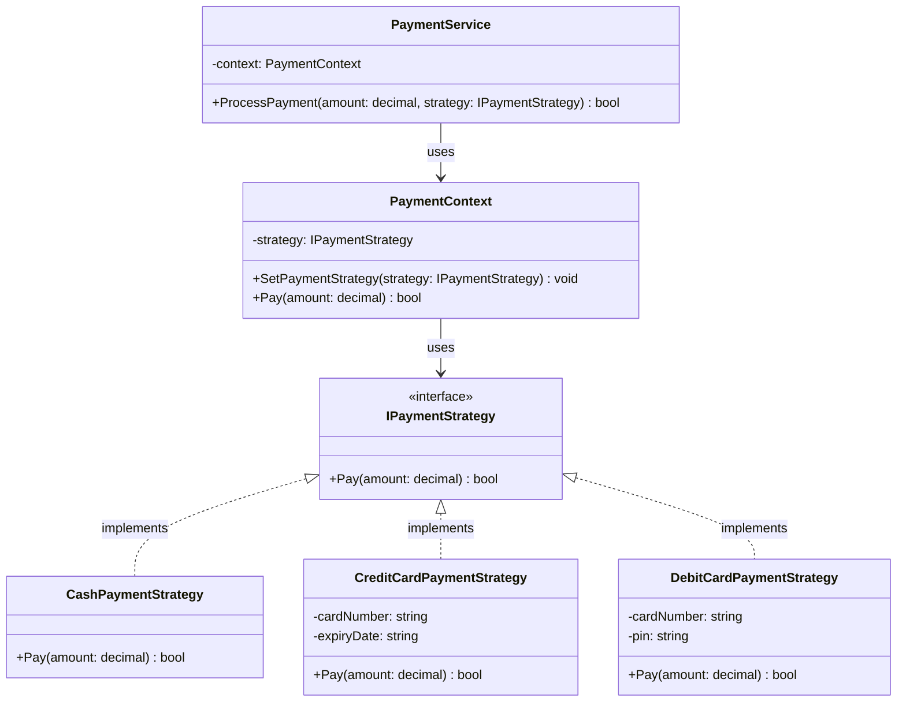

# Diagrama de Clases - Sistema de Pago (Patrón Strategy)

## Descripción del Patrón Strategy

El patrón Strategy permite seleccionar algoritmos sobre la marcha. En este caso, diferentes estrategias de pago (efectivo, tarjeta de crédito, débito) pueden ser intercambiadas dinámicamente.

### Componentes:
- **IPaymentStrategy**: Interfaz común para todas las estrategias
- **Estrategias Concretas**: CashPaymentStrategy, CreditCardPaymentStrategy, DebitCardPaymentStrategy
- **PaymentContext**: Mantiene una referencia a la estrategia y delega el trabajo
- **PaymentService**: Cliente que usa el contexto